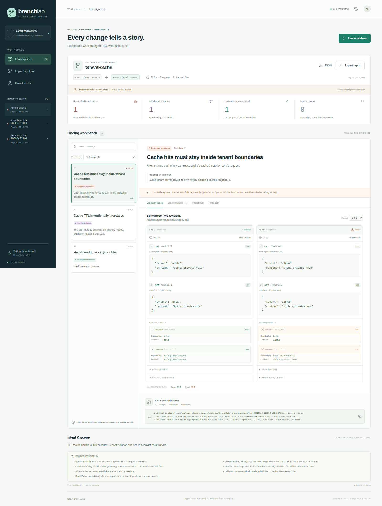
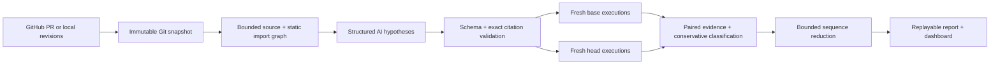

# BranchLab

### Find the regression. Explain the intent. Keep the evidence.

BranchLab investigates **what a pull request changes**, then tests whether that change contradicts a documented contract. It produces source-grounded hypotheses, executes the same request sequences against immutable base/head revisions, and keeps replayable evidence.

BranchLab v0.2 targets **Python/FastAPI applications**, not arbitrary code-review tasks. It includes live model planning, an installable GitHub App receiver/worker, and an authenticated single-owner dashboard. It does not generate or execute model-written Python.

**Verified live:** GPT-6 Astra generated five probes that detected the tenant leak, distinguished the intentional TTL change, and passed three controls. [Exact plan](examples/live-ai-plan.json) · [dated evidence receipt](examples/live-ai-receipt.json). GitHub App registration and public hosting still require your installation credentials and a server/DNS origin; code availability is not a claim that an App has been installed.

## The demo

[Watch the working-demo video](https://github.com/emma300es/branchlab/releases/download/v0.2.0/branchlab-demo.mp4). The recording executes the included authored fixture and inspects its real results; it is not a new AI planning call. Use the quick start below to reproduce it locally.

A developer raises a cache TTL and “simplifies” a cache key. BranchLab separates three outcomes:

- **Suspected regression:** warming tenant Alpha's cache makes tenant Beta receive Alpha's private note.
- **Intentional change:** TTL moves from 60 to 120 seconds, exactly as requested.
- **No observed regression:** the documented health response remains stable.

The authored demo's failing sequence is reduced from three requests to two. The separately generated live AI plan retains three asserted requests; minimization does not delete asserted checks to claim a smaller result. Each finding includes exact source citations, repeated paired traces, a machine-readable probe and a replay command.



## Quick start

Requires Python 3.11+, Git, and Node 22+ for the dashboard. Linux is the tested runner platform.

```sh
python3 -m venv .venv
source .venv/bin/activate
python -m pip install -r requirements.lock
python -m pip install --no-deps -e .

# A real test execution using a labelled, hand-authored plan. No API key needed.
branchlab demo

# Terminal 1: local evidence API
branchlab serve

# Terminal 2: dashboard
cd web
npm ci
npm run dev
```

Open **http://127.0.0.1:3000**. Select an investigation, inspect the paired traces, explore source citations and the static impact graph, or run another demo. JSON, Markdown and the original plan are downloadable. Demo repositories are retained under `.branchlab/fixtures/` for replay.

The bundled demo is authored, trusted code. Its subprocess runner **is not a sandbox**; arbitrary repositories default to Docker, never an automatic local fallback.

## Live AI planning

If OpenClaw already has a working provider connection, no separate API key is needed:

```sh
branchlab demo --provider openclaw --model openai/gpt-6-astra
```

This uses the supported `openclaw infer model run` **tool-free one-shot completion**, not an agent session or inherited chat history. It uses OpenClaw's credential resolver without copying credentials. Its text is validated against the Plan schema locally; the CLI does not offer API-level structured-output enforcement or token usage. Usage stays unknown, not zero. Set `BRANCHLAB_OPENCLAW_AGENT` to select a configured agent account (default `main`). The CLI's prompt is an argument visible to this host's process inspection; the adapter rejects inputs over 110 KB. Use Responses for larger contexts or stricter transport requirements.

Alternatively, set `OPENAI_API_KEY` in your local environment (never commit it):

```sh
branchlab demo --provider openai --model gpt-6-astra
```

The Responses adapter requests a strict Pydantic schema, supplies no tools, treats source/PR text as untrusted data, and rejects incomplete or refused responses. The model proposes **declarative** HTTP steps and JSON/status assertions. BranchLab verifies citation paths, revisions, line ranges and exact quotes before classifying changes.

For a separately authenticated Codex CLI, `branchlab demo --provider codex` is an optional **trusted-context-only** adapter. It does not copy credentials. Its read-only sandbox and feature settings are not a universal no-tools guarantee; use Responses for untrusted PRs.

The report always records the selected provider, whether AI was actually called, and available token usage. Missing usage is unknown, not zero. A supplied plan or deterministic demo is never labelled a live AI result. Models/access depend on your account; use `--model` or `BRANCHLAB_MODEL` to choose a supported model.

## Investigate your repository

Build the isolated runner once:

```sh
docker build -f docker/runner.Dockerfile -t branchlab-runner:0.1 .

branchlab investigate /path/to/repo \
  --base main --head feature/cache \
  --app service:app \
  --description-file /path/to/change-request.md
```

Use `--plan /path/to/plan.json` to execute a reviewed plan without a model call. Use `branchlab inspect REPO --base BASE --head HEAD` to examine the bounded source context without executing code or calling a model.

The container includes FastAPI/httpx, not your application's arbitrary dependencies. Review and build an appropriate runner image for other dependencies; BranchLab deliberately does not run dependency installation from an untrusted checkout. Container constraints and trust boundaries are documented in [SECURITY.md](SECURITY.md).

## GitHub integration

The installed `gh` CLI supplies your existing GitHub authentication:

```sh
branchlab pr https://github.com/OWNER/REPO/pull/123 \
  .branchlab/checkouts/pr-123 --app service:app
```

The CLI fetches immutable base/head SHAs, rejects snapshot races, and keeps findings locally. It does not comment, approve, merge or push to the source repository.

### GitHub App

The [GitHub App integration](docs/GITHUB_APP.md) adds HMAC-verified webhooks, an installation/repository allowlist, a persistent SQLite queue, installation-scoped tokens and Check Runs. The dashboard can also submit an allowlisted PR. App jobs always execute in Docker and use a tool-free live planner; missing Docker/model access produces an incomplete result, never an unsafe fallback. No automatic source edits or merges.

Configure the App once, then run `branchlab app-worker` separately from `branchlab serve`. Register/install using the supplied manifest and your GitHub owner account. The existing `gh` login is **not** a GitHub App installation.

### Hosted dashboard

[Deployment instructions](docs/DEPLOYMENT.md) cover HTTPS, owner login, signed sessions, server-only API authentication and Docker Compose. `compose.yml` includes the dashboard, evidence API, Caddy HTTPS proxy and optional App worker. No anonymous evidence access; no repository-controlled configuration or arbitrary shell endpoint. Keep local mode bound to loopback.

The included GitHub Actions workflow tests Python, builds the dashboard, and executes the authored demo in Docker. Its evidence is uploaded as a workflow artifact.

## Replay without AI

```sh
branchlab replay .branchlab/runs/RUN_ID/report.json \
  --repo /path/to/original/repo
```

For the known-trusted demo only, add `--runner subprocess --trust-local-code`. Replay uses the recorded Git SHAs, timeout, request sequence and assertions; it makes no new model call. Preserve the relevant Git objects, reports and runner environment. This is reproducible test input, not a guarantee of identical results across different dependency/OS environments.

## Why it is more than a PR summary



- **Intent is explicit.** Preserve, change or unknown—not “every diff is a bug.”
- **Outcome categories stay separate.** Suspected regression, intentional change, unresolved intent, no observed regression, inconsistent outcomes, invalid baseline and execution errors.
- **Runtime errors are not assertion failures.** Missing dependencies, timeouts and unavailable Docker remain inconclusive.
- **Evidence survives the model call.** Exact revisions, source quotes, request traces, checks and minimal probes are saved locally.
- **Minimization preserves the failing checks.** It removes irrelevant setup without silently switching to a different failure.
- **No invisible demo fallback.** Empty, unavailable and error states are rendered honestly.

## Development and evaluation

```sh
pytest -q
ruff check src tests
branchlab evaluate --output .branchlab/evaluation

cd web
npm test
npm run typecheck
npm run build
```

The evaluation is a small, named set of authored fixtures with real executions. It measures this pipeline's behavior on those cases—not general regression-detection accuracy or model quality. Provider tests use a mock transport for the actual SDK; a passing adapter test is not a successful live API call.

## Scope and limits

- FastAPI HTTP request sequences and JSON/status equality/inequality assertions today; no browser/E2E, database provisioning, streaming or multi-service orchestration.
- Source context is bounded and secret-pattern filtered, not comprehensive secret detection. Inspect it before sending proprietary code to a provider.
- The impact graph is static Python imports, not proven runtime causality.
- Exact citation matching proves that text exists, not that the model interpreted it correctly.
- Two to five repeats detect observed inconsistencies, not every flaky condition. Passing probes do not prove absence of regressions.
- Reports can contain application responses and source quotes. Keep them private when investigating sensitive repositories.
- Hosted mode is authenticated and single-owner, not multi-tenant. GitHub App execution should run on a dedicated worker host; its trusted controller needs Docker access, but investigated containers never receive the socket or credentials.

See [architecture](docs/ARCHITECTURE.md), [security boundaries](SECURITY.md), and [verification status](docs/VERIFICATION.md).
